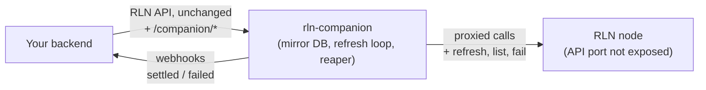

# rln-companion

A sidecar that sits in front of your RGB Lightning Node (RLN). You talk to the companion instead of the node: same API, same paths, same payloads. The companion watches what goes through, keeps the node's transfers moving, and calls you back when something settles or fails.



> [!CAUTION]
> **Proof of concept. Not production software.**
>
> A node fronted by a companion must be used **only through the companion**. Never call the node's API directly, never share the node's API port, never run two companions against one node. The companion's picture of your transfers is only right if it sees every single call. Break that rule and transfers can get stuck, webhooks can lie, and money can sit unclaimed with nobody noticing.
>
> The only two supported ways to run a node: **RLN alone**, or **RLN behind exactly one companion**.

## What it does for you

| Without the companion | With the companion |
| --- | --- |
| You must call `/refreshtransfers` in a loop, with the right body, at the right cadence, or transfers never settle (and non-donation sends are never even broadcast) | The companion drives refresh by itself, only while something is pending |
| You must remember identifiers RLN never returns again (`batch_transfer_idx`) to cancel expired transfers | The companion keeps them and fails expired transfers for you |
| You poll `/listtransfers` per asset to learn that a transfer settled | You get a signed webhook: `transfer.confirmed_pending`, `transfer.settled`, `transfer.failed` |
| RLN's refresh answers `{}` whatever happened | The companion diffs transfer state and reports real transitions |

Everything else is a transparent proxy: any RLN route works through the companion exactly as it does on the node, including auth (RLN keeps enforcing its own tokens).

## Run it

The reference deployment is Docker Compose: node and companion together, node API port only on the internal network, companion on `127.0.0.1:3101`.

```sh
cd deploy
cp companion.toml.example companion.toml   # set webhook url and secret
docker compose up --build --wait
curl -s 127.0.0.1:3101/companion/health
```

From source instead:

```sh
cargo build --release
cp sample-config.toml config.toml           # set [rln] base_url, [webhook] url and secret
./target/release/rln-companion --config config.toml
```

Then point your integration at `http://127.0.0.1:3101` and keep using the RLN routes as before: `/init`, `/unlock`, `/rgbinvoice`, `/sendrgb`, `/nodeinfo`, all of them.

## What a webhook looks like

You create an invoice through the companion, hand it to the payer, and forget about it. When the transfer settles, the companion POSTs to your `webhook.url`:

```http
POST /hook HTTP/1.1
content-type: application/json
x-companion-event-id: 5c0f2c6e-1a4b-4f2d-9c3e-8b7a6d5e4f30
x-companion-signature: 9f3b7c2e1d...   (hex HMAC-SHA256 of the body, keyed with webhook.secret)

{
  "event_id": "5c0f2c6e-1a4b-4f2d-9c3e-8b7a6d5e4f30",
  "event_type": "transfer.settled",
  "transfer": {
    "id": "2f9d8c1b-7e6a-4d5c-b3a2-1f0e9d8c7b6a",
    "kind": "ReceiveBlind",
    "status": "Settled",
    "asset_id": "rgb:2dkSTbr-jFhznbPmo-TQafzswCN-av4gTsJjX-ttx6CNou5-M98k8Zd",
    "recipient_id": "utxob:2FZsSxN-...",
    "txid": "9f0c3b1e...",
    "settled_at": 1756640420
  },
  "previous_status": "WaitingConfirmations",
  "new_status": "Settled",
  "timestamp": 1756640420
}
```

Your handler does three things: verify the signature, skip event ids you have already seen, answer `200`. That is the whole contract.

```python
expected = hmac.new(secret, raw_body, "sha256").hexdigest()
if not hmac.compare_digest(expected, headers["x-companion-signature"]):
    return 401
if seen(headers["x-companion-event-id"]):
    return 200
mark_paid(order_for(payload["transfer"]["recipient_id"]))
return 200
```

Three event types: `transfer.confirmed_pending` (broadcast, waiting for confirmations), `transfer.settled`, `transfer.failed`. Delivery is at-least-once, in order, with retries and backoff; events that keep failing are parked and show up in health. Full details in [docs/webhooks.md](docs/webhooks.md).

## Health at a glance

```sh
curl -s 127.0.0.1:3101/companion/health
{"status":"ok","node":"unlocked","pending_transfers":1,"parked_events":0,"last_full_sync_at":1756640000}
```

`status` is `ok` only when the node is unlocked and no webhook is stuck; anything else is `degraded` and the other fields say why.

## Documentation

| Topic | Read |
| --- | --- |
| Deploying with Docker Compose, switching to Biscuit auth, data locations | [deploy/README.md](deploy/README.md) |
| Every config key, its default, CLI flags | [docs/configuration.md](docs/configuration.md) |
| What the proxy does and which routes are intercepted | [docs/proxy.md](docs/proxy.md) |
| `/companion/*` endpoints and errors | [docs/api.md](docs/api.md) |
| Webhook payload, signature, delivery guarantees | [docs/webhooks.md](docs/webhooks.md) |
| Startup, locking, migrations, what to expect in operation | [docs/operations.md](docs/operations.md) |
| Unit tests, regtest end-to-end suite, CI | [docs/testing.md](docs/testing.md) |
